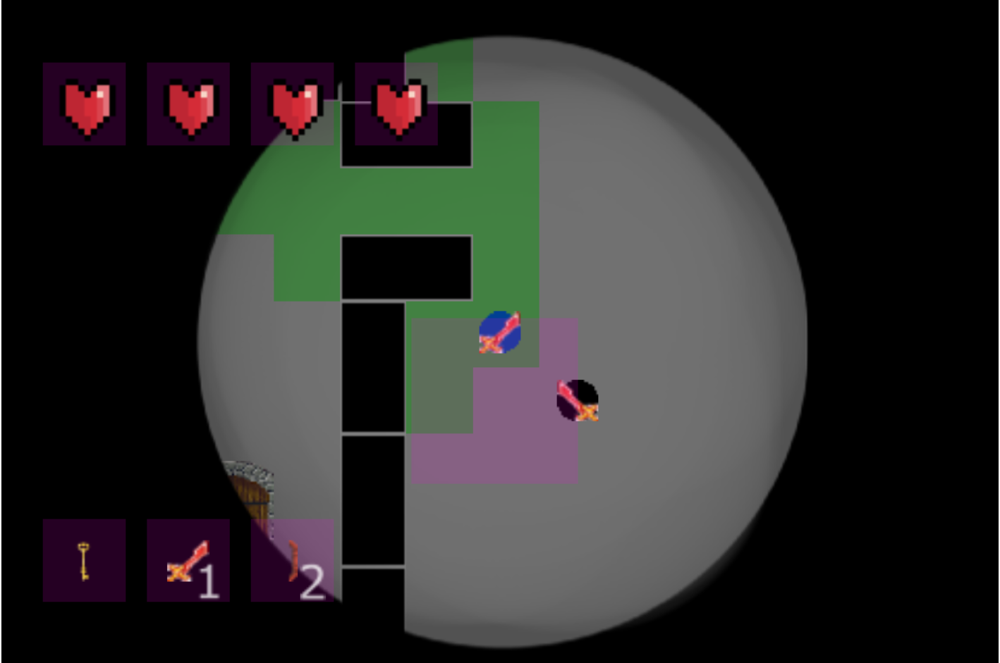

# A Stealth Game
This javascript game is a project of the "Software de Entretenimiento y Videojuegos" subject
of the "Escuela de Ingeniería Informática de Oviedo".

The task of the project is to create a javascript game without external libraries and using 
a simple but useful game engine provided by the teachers.

The game can be found here: https://jesqm.github.io/stealthGame/, it does take some time to
load (does weight quite a lot for a web page).

## Controls
* Movement: Arrow keys

* Select weapon: numbers; 1, 2
    * Weapon must be picked up first.

* Attack: space bar
    * A weapon must be equipped.

* Mute: M or N
    * M mutes all the sound.
    * N mutes just the music.

## Features
All available features can be explored in the first level easily, 
as weapons, key, door and hostages are close to the player.

#### Game Mechanics

##### Game items
* Items may be picked up in order to use them.
* Sword and Shield can be selected and used as a weapon.
* Swords damage enemies you stand near when pressing space, after a brief delay.
* Shields may only be used to deflect incoming arrows.
* The key must be picked up in order to open the door that leads to the next level.

##### Enemies
* All enemies have a field of view, showed by the purple rectangle.
* Enemies will follow the player if he stands in front of the rectangle, with no wall blocking. 
If the player is seen, the background music will change.
* Two kind of enemies (Sword enemies, Bow enemies).
* Sword enemies will have a sword and will follow and melee the player or hostages.
* Bow enemies will slowly walk towards the player or hostages if seen, shooting arrows at them.
* If an enemy receives damage, they will stagger, so their speed will decrease briefly and increase back 
to a fraction of their total speed (in other words: a nearly dead enemy will walk much slower than a full health one).

##### Hostages
* Hostages may be rescued to earn points (green circles).
* Hostages must be delivered alive to the door in order to earn points.
* Hostages will follow the player chain-like (following the last hostage).
* Enemies that see free hostages will target them, still, prioritizing the player.

##### Bushes

    

* Bushes will hide the player from enemies (the player, not the hostages).
* You cannot hide while being followed by an enemy, you must lose it first.
* You can notice you are hidden due to the reduced view of the map you have and the slight music change.
* While hidden, you can perform a critical hit to an enemy; attacking an enemy will deal a killing blow.

### External models by:
* Key model: https://opengameart.org/users/armisius
* Door model: Castle door by Tuomo Untinen
* Bow model: Heather Lee Harvey, EmeraldActivities.com & http://opengameart.org/users/emerald
* Heart model: NicoleMarieProductions (https://opengameart.org/users/nicole-marie-t)
* Blood splats: PWL (https://opengameart.org/users/pwl)
* Skull model: pechvogel (https://opengameart.org/users/pechvogel)

### Sound by:
* Knife sounds: https://opengameart.org/content/knife-sharpening-slice-1, https://opengameart.org/content/knife-sharpening-slice-2
* Shield sounds: Minecraft shield sounds.
* Critical hit sound: Team fortress 2 critical hit sound effect.
* Other sounds: Philippe Groarke (https://opengameart.org/content/punches-hits-swords-and-squishes)
* Background track: Perfect Dark (N64 year:2000) Chicago theme.
